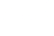
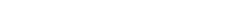

# Cellular Automata: A "Clusters" Variation


A web based cellular automata simulation playground powered by my own variation of [Jeffrey Ventrella's "Clusters"](http://www.ventrella.com/Clusters) algorithm. It simulates the movement and interaction of up to a million particles using rules of attraction and repulsion, creating complex and organic patterns.

### Features

- Simulate up to a million interacting particles.
- Customizable attraction/repulsion rules between particle types.
- Adjustable physics parameters for diverse behaviors.
- GPU accelerated with WebGL.
- Live experimentation with interactive controls.

##

<div align="center">
    
    <p><a href="http://cells-sim.vercel.app">cells-sim.vercel.app</a></p>
</div>

## How It Works

### Particle State

The simulation consists of a population of up to a million particles. Each particle is a distinct entity defined by its state, which includes:

- **Position** `(x, y)`: Its coordinates in the 2D space.
- **Velocity** `(v_x, v_y)`: Its speed and direction of movement.
- **Type**: Red, Green, Blue, Yellow, Cyan, or Magenta.

### Rules of Interaction

The simulation's emergent behavior lies in a `6x6` interaction matrix. This matrix defines the core laws of the simulated space, specifying the force between any two particle types. For a particle of type `A` and a particle of type `B`, the matrix contains a value `g`, that dictates their interaction.

- If `g` is **positive**, the force is **attractive**, pulling the particles together.
- If `g` is **negative**, the force is **repulsive**, pushing them apart.

The magnitude of this interaction coefficient determines the strength of the force. At the start of each simulation, or when the rules are randomized, this matrix is populated with random values between `-1` and `1`. These randomizations lead to an almost infinite diversity of patterns.

<br>
<div align="center">
<table>
  <tr>
    <th></th>
    <th>Red</th>
    <th>Green</th>
    <th>Blue</th>
    <th>Yellow</th>
    <th>Cyan</th>
    <th>Magenta</th>
  </tr>
  <tr>
    <th>Red</th>
    <td>0.8</td>
    <td>-0.5</td>
    <td>0.2</td>
    <td>-0.7</td>
    <td>0.1</td>
    <td>-0.3</td>
  </tr>
  <tr>
    <th>Green</th>
    <td>-0.4</td>
    <td>0.7</td>
    <td>-0.6</td>
    <td>0.3</td>
    <td>-0.2</td>
    <td>0.5</td>
  </tr>
  <tr>
    <th>Blue</th>
    <td>0.3</td>
    <td>-0.1</td>
    <td>0.9</td>
    <td>-0.8</td>
    <td>0.4</td>
    <td>-0.5</td>
  </tr>
  <tr>
    <th>Yellow</th>
    <td>-0.6</td>
    <td>0.2</td>
    <td>-0.7</td>
    <td>0.6</td>
    <td>-0.3</td>
    <td>0.8</td>
  </tr>
  <tr>
    <th>Cyan</th>
    <td>0.2</td>
    <td>-0.4</td>
    <td>0.5</td>
    <td>-0.2</td>
    <td>0.7</td>
    <td>-0.6</td>
  </tr>
  <tr>
    <th>Magenta</th>
    <td>-0.5</td>
    <td>0.3</td>
    <td>-0.8</td>
    <td>0.4</td>
    <td>-0.1</td>
    <td>0.9</td>
  </tr>
</table>
</div>
<p align="center"><em>Example Matrix<br>Values &gt;0 indicate attraction; values &lt;0 indicate repulsion.</em></p>
<br>

### Force Law and Simulation Loop

The simulation evolves in discrete time steps. In each step, the following calculations are performed for every particle in parallel:

- **Force Calculation**: The net force on a particle is the sum of forces from all other particles within a predefined `maxDistance`. The force exerted by one particle on another follows a simplified gravity-like law:

  <br>
  <div align="center">
    
  </div>
  <br>

  where `g` is the interaction value from the rules matrix and `d` is the distance between the particles. This inverse relationship means that closer particles exert a stronger influence.

- **Numerical Integration**: Once the total force vector is calculated for a particle, its velocity and position are updated using a semi-implicit Euler integration method:

  <br> 
  <div align="center">
    
    <br/>
    
  </div>
  <br>

  The `damping` factor acts like friction, preventing the system from becoming unstable and allowing structures to form and stabilize.

- **Boundary Conditions**: A simple wall repulsion force is applied to keep particles within the visible area, preventing them from flying off-screen.

### Computing

To make the real-time simulation of thousands of particles possible, the entire computational workload is offloaded to the GPU using WebGL.

- **Data as Textures**: Particle data (position and velocity) is stored in WebGL textures. Each pixel in a texture corresponds to a single particle, with the pixel's RGBA color channels used to encode the `x, y, vx, vy` values.

- **"Ping-Pong" Technique**: The simulation loop is implemented in a GLSL fragment shader. This shader reads the particle states from an input texture (`u_particles`), performs the force and integration calculations, and writes the new states to an output texture. To avoid reading from and writing to the same texture simultaneously, two textures are used in a "ping-pong" fashion. On each frame, the roles of the input and output textures are swapped.

### Emergence

The organic looking patterns you see are not explicitly designed. They are **emergent properties** of the algorithm. The interaction rules, when applied simultaneously to thousands of particles, give rise to self-organizing structures. Depending on the rule set, you can see behaviors similar to flocking, cellular division, predator-prey dynamics, and the formation of stable, complex "organisms." Cellular automata like this show how complexity can arise from simplicity, a fundamental concept in chaos theory and artificial life.

<!-- TODO: Add a gallery of screenshots here -->

The simulation consists of two main shaders:

- **Step Shader:** This shader is responsible for updating the position and velocity of each particle based on a set of rules. These rules define the attraction and repulsion forces between different types of particles.
- **Render Shader:** This shader is responsible for rendering the particles to the screen. It uses the particle positions and types to draw each particle with its corresponding color.

The simulation space is very customizable, many parameters are adjustable such as the number of particles, the rules of interaction, and the physics.

## Usage

The simulation can be controlled using the settings panel, in the top-right corner of the screen. The following can be adjusted:

- **Overlay:** Toggles the visibility of the overlay, which displays the UI excluding for the settings and theme button.
- **Analytics:** Controls the visibility of the current rules and physics tables at the bottom left of the screen.
- **Population:** Controls the number of particles in the simulation.
- **Physics:** Controls the physical properties of the simulation. You can adjust parameters such as:

  - `maxDistance`: Maximum distance for particle interactions.
  - `damping`: Amount of velocity reduction per step (friction).
  - `timeScale`: Speed at which the simulation runs.
  - `wallRepel`: Strength of repulsion from the simulation boundaries.
  - `wallForce`: Additional force applied near the walls.
  - `particleSize`: Size of each particle.
  - `mouseRepel`: Strength of repulsion from the mouse cursor.

View settings can be controlled using the following mouse and keyboard shortcuts:

- **Click and drag:** Camera panning.
- **Scroll wheel:** Zoom in/out.

## Technologies

<p align="center">
  <a href="https://github.com/sebilune">
    
  </a>
</p>

- **[React:](https://react.dev/)** JavaScript library for UI.
- **[TypeScript:](https://www.typescriptlang.org/)** Typed superset of JavaScript.
- **[Vite:](https://vite.dev/)** Build tool for modern web apps.
- **[regl:](https://github.com/regl-project/regl)** Functional WebGL library.
- **[GLSL:](https://docs.gl/sl4/all)** OpenGL Shading Language.
- **[Tailwind CSS:](https://tailwindcss.com/)** Utility CSS framework.
- **[Shadcn:](https://ui.shadcn.com/)** React UI components via [Radix UI](https://www.radix-ui.com/).

## Installation

If you would like to get a local build of this project, clone the repository and install the dependencies:

```bash
git clone https://github.com/sebilune/cells-sim.git
cd cells-sim
npm install
```

Then, start the development server:

```bash
npm run dev
```

This will start the development server at `http://localhost:5173`.

##

This project was made as an exploration of mine into the field of Artificial Life, to understand how complex cellular behaviors can emerge from a simple set of rules. 

## License

This project is licensed under the MIT License. See the [LICENSE](./LICENSE) file for more information.
